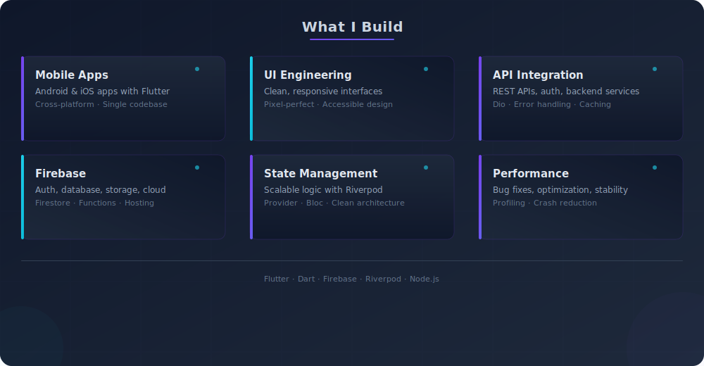
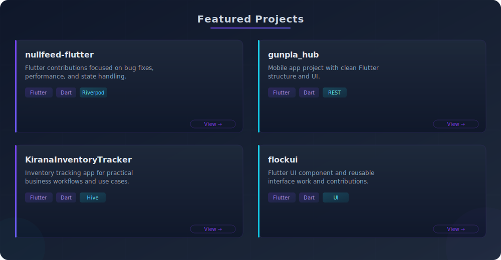

  

  

  Building clean, scalable Flutter apps with modern UI, APIs, Firebase, and reliable state management.

  
  
  
  

---

### About

- Build cross-platform mobile apps with Flutter and Dart
- Work with Firebase, REST APIs, and backend integrations
- Focus on clean UI, performance, state management, and maintainable code
- Open to Flutter Developer / Mobile App Engineer opportunities

---

### Skills

  <b>Mobile:</b>
  
  
  
    
  <b>Backend:</b>
  
  
  
  
    
  <b>Cloud & Data:</b>
  
  
  
    
  <b>Tools:</b>
  
  
  

---

### What I Build

---

### Featured Projects

> Some client projects are private. I can share details, screenshots, or demos on request.

---

### Open Source Contributions

  Merged PRs and contributions across public repositories. Updated daily via GitHub Actions.

<!-- OSS-CONTRIBUTIONS:START -->

Loading contribution data...

<!-- OSS-CONTRIBUTIONS:END -->

---

### GitHub Stats

  
  
    
  

---

### Contribution Graph

  

---

  Open to Flutter Developer and Mobile App Engineer opportunities.
    
  <a href="mailto:dev.syedmoizali@gmail.com">Email</a> ·
  <a href="https://www.linkedin.com/in/dev-syed-moiz-ali/">LinkedIn</a> ·
  <a href="https://github.com/Syed-Moiz-Ali">GitHub</a>

